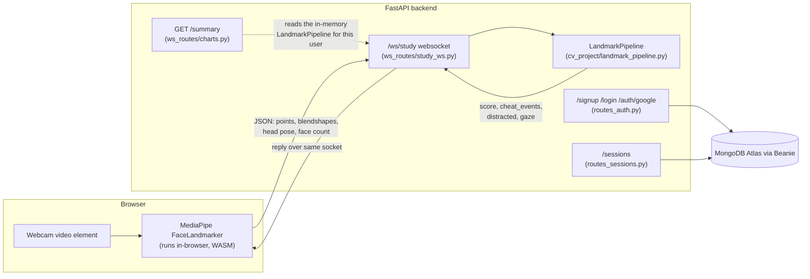

# FocusAgent

A study-session tracker that watches whether you're looking at your screen, using face tracking that runs
entirely in your browser.

- Frontend: https://focusagent-frontend.onrender.com
- Backend: https://focusagent-v2.onrender.com

## What it does

- **Live focus-scoring session.** Start a timed session, and the app scores how focused you are roughly
  5 times a second while it runs, with a live score and a "distraction detected" indicator.
- **Calibration.** Before a session starts, you follow a dot around the edge of your screen (and
  optionally look at five points on a second screen), guided by recorded voice prompts. This maps your
  actual eye and head movement to an on-screen range, instead of assuming a fixed gaze angle.
- **End-of-session summary.** A timeline of the whole session broken into focused, distracted and
  not-tracked stretches, plus total focused time and the longest focused stretch.
- **History.** Past sessions are saved to your account and listed with the same stats, and can be deleted.

## Architecture



**Face tracking runs in the browser, not on the server.** `frontend/src/lib/faceLandmarker.ts` loads
MediaPipe's FaceLandmarker (WASM + a model file, both from CDNs) and runs it against the webcam's
`<video>` element directly in the page. No video frame or image ever leaves the browser. What travels
over the websocket is JSON: 10 landmark point coordinates, 10 eye blendshape scores, the head pose
(yaw/pitch from the facial transformation matrix), and the face count — sent roughly every 200ms from
`frontend/src/pages/Session.tsx`.

On the backend, `ws_routes/study_ws.py` is the single `/ws/study` endpoint. Its first message must be
`{"duration": minutes, "token": "<JWT>"}`; an invalid or missing token closes the connection with code
`4401`, which the frontend treats as "sign in again". Every message after that is handed to a
`LandmarkPipeline` instance (`cv_project/landmark_pipeline.py`) created for that connection and kept in an
in-memory dict keyed by user id, so a user's latest session stays readable after their socket closes.

The pipeline has two message types:
- `{"type": "calibration", "phase": ...}` — collects gaze-angle samples while the user follows the dot
  (or the five second-screen points) and, on `"done"`, computes the on-screen gaze range and starts the
  session clock.
- `{"type": "landmarks", ...}` — once calibrated, each one is scored by `get_gaze_score()`: a horizontal
  gaze angle (head yaw corrected by how far the eyes are turned in their sockets) checked against the
  calibrated range, plus vertical head/iris rules and an eyes-closed streak. The reply carries the score,
  any `cheat_events`, a `distracted` flag, and the gaze angle. Pure geometry (`euclidean`, `eye_openness`,
  `head_down_ratio`, iris ratios) lives separately in `cv_project/geometry.py`.

At session end, the frontend builds the timeline from the scores it received and `POST`s it to
`/sessions` (`routes_sessions.py`), which saves it to MongoDB. `GET /summary` (`ws_routes/charts.py`)
rebuilds the same shape of summary from the just-finished in-memory session, for the page shown right
after a session ends; `GET /sessions` and `/history` read back what's been saved.

## Auth and data

- Passwords are hashed with bcrypt (`passlib[bcrypt]`, `backend/auth.py`), never stored in plain text.
- Signing in (password or Google) returns a JWT (`pyjwt`, HS256, 7-day expiry) carrying the user id. The
  frontend attaches it as `Authorization: Bearer <token>` on REST calls (`frontend/src/lib/api.ts`) and
  sends it as part of the websocket's first message.
- Google sign-in uses the OAuth authorization-code flow (`routes_auth.py`): `/auth/google` redirects to
  Google with a random `state` value kept in an httponly cookie, `/auth/google/callback` checks that
  state matches before exchanging the code, then verifies the returned ID token with Google's library
  before trusting the email in it.
- The websocket rejects a missing or invalid token by closing with code `4401`; the frontend treats that
  code as "not signed in" and clears its stored token.
- Each live session is scoped to the signed-in user: `study_ws.py` keys sessions by user id, and
  `/summary` only ever returns the calling user's own session.
- Data is stored in MongoDB Atlas, accessed through Beanie's `Document` models (`backend/models.py`) over
  Motor.

## Stack and deployment

- **Backend:** FastAPI + Uvicorn, Beanie/Motor over MongoDB Atlas, deployed on Render as a Docker-based
  web service (`backend/Dockerfile`, `backend/render.yaml`) with `autoDeploy: true`.
- **Frontend:** React + TypeScript + Vite + Tailwind, MediaPipe's FaceLandmarker running client-side
  (no server-side CV library), deployed on Render as a static site with auto-deploy from the repo.
- **Beanie is pinned to `2.0.1`** (with matching `motor==3.7.1` and `pymongo==4.18.2`). From `2.1.0`,
  Beanie's `init_beanie` calls `client.append_metadata()`, which exists on PyMongo's async client but not
  on Motor's, so startup fails with `"MotorDatabase object is not callable"`. `2.0.1` is the last release
  before that call was added.

## Local setup

Backend:

```bash
cd backend
python3.12 -m venv myenv && source myenv/bin/activate
pip install -r requirements.txt
cp .env.example .env   # fill in real values, see below
./start_server.sh      # runs on port 8001 (or the next free port)
```

Frontend:

```bash
cd frontend
npm install
# create .env.local with VITE_MEDIAPIPE_API_URL=http://localhost:8001
# (overrides the committed .env, which points at production)
npm run dev             # runs on Vite's default port, 5173
```

Backend environment variables (`backend/.env.example`):

| Variable | Purpose |
|---|---|
| `MONGODB_URI` | MongoDB Atlas connection string |
| `JWT_SECRET` | Signing key for session JWTs |
| `GOOGLE_CLIENT_ID` | Google OAuth client id |
| `GOOGLE_CLIENT_SECRET` | Google OAuth client secret |
| `GOOGLE_REDIRECT_URI` | Must match the callback registered with Google (`.../auth/google/callback`) |
| `FRONTEND_URL` | Where `/auth/google/callback` redirects back to after sign-in |

Frontend environment variable:

| Variable | Purpose |
|---|---|
| `VITE_MEDIAPIPE_API_URL` | Base URL of the backend (REST + websocket), e.g. `http://localhost:8001` |

**Python version:** a local `backend/myenv` venv built with Python 3.9 may hit dependency resolution
issues, since `backend/render.yaml` and `backend/Dockerfile` both pin Render's build to Python 3.12. Build
your local venv with 3.12 to match.

## Known limitations

- `/signup` doesn't verify the email address. `routes_auth.py`'s `find_or_create_user` links a Google
  sign-in to an existing password account by email alone, so an account pre-registered with someone
  else's email address could end up linked to that person's Google identity.
- A JWT can't be revoked before it expires (7 days) — there's no server-side blocklist or session table,
  only `exp` in the token. It's stored in `localStorage` on the frontend (`frontend/src/lib/api.ts`), so
  it persists across browser restarts and is readable by any script that can run on the page.
- CORS is wide open (`allow_origins=["*"]` in `backend/main.py`).
- Live sessions live in an in-memory dict in the backend process (`_sessions_by_user` in
  `ws_routes/study_ws.py`), consistent with `render.yaml` pinning the service to exactly one instance
  (`minInstances`/`maxInstances: 1`). A restart or redeploy loses any session that hasn't been `POST`ed to
  `/sessions` yet, and this won't survive scaling past one instance.
- Only horizontal gaze is calibrated. Vertical attention (looking down, iris vertical position) still
  uses the older fixed-threshold rules in `get_gaze_score()`, not a calibrated range.
- No automated tests are checked into the repo (only ad hoc `*.log` files from manual test sessions,
  which are gitignored).
- The MongoDB Atlas network allowlist is open to all IPs for convenience. It could be restricted to
  Render's published outbound IP ranges for the service's region, plus a developer IP.
- The Render free-tier backend sleeps after inactivity, so the first load after a period of no traffic
  can take about a minute.

## Screenshots

_Not included yet — placeholders below._

- [ ] Home / landing page
- [ ] Setup page (duration picker, camera check)
- [ ] Calibration in progress (the scan dot)
- [ ] A live session (score + distraction indicator)
- [ ] Summary page (timeline + stats)
- [ ] History page
